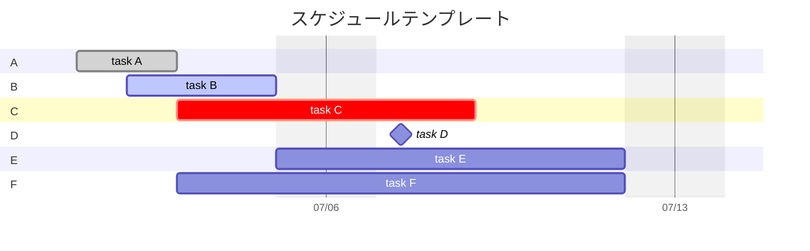

# スケジュールテンプレート

```mermaid
gantt
    title スケジュールテンプレート
    dateFormat  YYYY-MM-DD
    axisFormat  %m/%d
    excludes    weekends
    tickInterval 1week

    section A
    task A      :done,      a1, 2025-07-01, 2d

    section B
    task B      :active,    b1, 2025-07-02, 3d

    section C
    task C      :crit,      c1, 2025-07-03, 4d

    section D
    task D      :milestone, d1, 2025-07-04, 5d

    section E
    task E      :           e1, 2025-07-05, 6d

    section F
    task F      :after a1   f1, 7d

```
